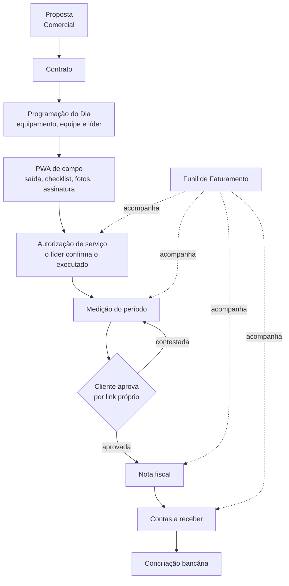

# Movimentar ERP

O sistema de gestão da **Movimentar Locações** — locação de equipamentos com
operador para obras. Ele cobre a corrente inteira de uma operação: o cliente
pede, a proposta é aprovada, o equipamento vai para a obra com equipe, o líder
confirma o que foi executado, o período é medido, a nota sai e o dinheiro entra.

O que o sistema existe para responder, na frase do dono:

> "Que a gente consiga acompanhar o processo do início ao fim."

## Quem usa, e por onde

<CardGroup cols={2}>
  <Card title="Escritório" icon="desktop">
    Comercial, financeiro e administração usam a **tela larga**, com a lateral de
    módulos. É onde a proposta nasce, a operação é programada e a cobrança é
    acompanhada.
  </Card>
  <Card title="Campo" icon="helmet-safety">
    O operacional usa o **PWA de campo**, em celular. Ao logar, ele cai direto lá
    — não passa pelo escritório. Funciona **offline**: o que for registrado sem
    sinal entra numa fila e sobe quando a conexão volta.
  </Card>
</CardGroup>

## A corrente, de ponta a ponta

O **Funil de Faturamento** não é mais um passo: é a tela que olha os quatro
últimos e diz onde cada operação parou e há quanto tempo. É por ela que se
descobre dinheiro represado antes que o cliente reclame.

## O que fica sempre à mão

Cinco telas ficam soltas no **topo da lateral**, sem grupo, porque são as que se
abre todo dia:

| Tela | Para que serve |
|---|---|
| **Visão geral** | O painel: como está a operação hoje |
| **Alertas** | O que exige ação — vencimento, pendência, divergência |
| **Programação do Dia** | O quadro do dia: equipamento, equipe, líder e atividade |
| **Funil de Faturamento** | Onde cada operação parou entre o executado e o recebido |
| **WhatsApp** | O canal com o cliente, dentro do sistema |

O resto do sistema fica nos grupos abaixo desses atalhos —
[a lista completa está em Módulos](/modulos).

## Por onde começar

<Card title="Tutorial" icon="graduation-cap" href="/tutorial">
  O passo a passo da corrente, do orçamento ao recebimento.
</Card>
